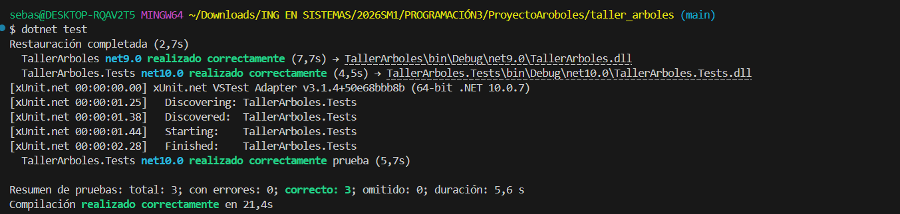

# Taller integrador - Arboles binarios en C#

Proyecto académico para la empresa ficticia DocuTrack S.A. El programa gestiona carpetas y archivos en un árbol binario de búsqueda usando el nombre como clave.

## Integrantes y responsabilidades

- Camilo De la Cruz: implementación del modelo BST, controlador de casos de uso, vista de consola y documentación.
- Sebastián Cardona: Diseño de los casos de prueba, validación de la lógica de eliminaciones casos 0, 1, 2 hijos y revision del flujo del programa y salidas en consola. Desarrollo del módulo de pruebas unitarias (xUnit).

## Requisitos para ejecutar

- .NET SDK 9.0 o superior.

## Ejecución

```powershell
dotnet run --project .\TallerArboles\TallerArboles.csproj
```

## Modulo De Pruebas (QA)

```powershell
dotnet test
```

## GARANTIA DE CALIDAD

Se implemento un modulo de de pruebas automatizadas que garantiza :

- `Case.Insentivity`: Los nombres "Carpeta" y "carpeta" se tratan como duplicados para evitar conflicto en el sistema de archivos
- `Integridad Post-Eliminación`: Validación de que el trayecto de inOrden se mantiene inocuo y perfectamente alfabético tras eliminar nodos con dos hijos
- `Seguridad De Archivos`: Verificación de que los archivos se mantengan siempre como hojas del árbol.

<p align="center">
  
</p>

## Fkujo De Ejecución

Al ejecutar el programa, el controller maneja una serie de fases secuenciales, que demuestran el funcionamiento completo del árbol de busqueda, de esta manera:

- `Construcción Inical`: Se insertan 14 elementos (con mezclas entre archivos y carpetas) para formar la estructura base. Se incluye una validación que rechaza de manera intencional un elemento duplicado para demostrar que las politicas de integridad se cumplan. Se finaliza mostrando el árbol en formato ASCII.
- `Busquedas Rapidas`: Se realizan 6 busquedas predeterminadas (4 con éxito y 2 fallidas). El sistema genera el reporte de si es archivo o carpeta, y presenta el número de comparaciones realizadas. comprobando la eficiencia de busqueda del BST.
- `Actualizaciones Selectivas`: Se modifica el nombre de tres nodos distintos (una hoja, un nodo, la raiz). El programa demuestra la estrategia de "eliminar + insertar", evidenciando cómo el árbol se reestructura demanera automática tras cada cambio mediante diagramas de ASCII.
- `Eliminaciones Selectivas`: Se colocan a prueba los tres contextos matemáticos de la eliminación en un BST:
  - Nodo hoja
  - Nodo con un solo hijo
  - Nodo con dos hijos (utilizando el sucesor inorden para la sustitución)
- `Recorridos Y Métricas`: Por último, el programa recorre el árbol resultante en sus 4 formas clasicas (PreOrden, InOrden, PostOrden y por Niveles) y calcula la latura final de la estructura, validando matemáticamnte que el árbol conserva la integridad.

## Arquitectura MVC

- `Models`: contiene `Nodo`, `ArbolBinario` y resultados de operaciones. No usa `Console`.
- `Views`: contiene `ConsolaView`, responsable de imprimir resultados, métricas y el árbol en ASCII.
- `Controllers`: contiene `TallerArbolesController`, que secuencia los casos pedidos por el taller.
- `Program.cs`: solo crea modelo, vista y controlador; no tiene lógica de negocio.

## Decisiones del BST

- La clave es `Nombre`.
- La comparación ignora mayúsculas y minúsculas usando cultura invariante.
- Los duplicados se rechazan y se reportan en consola.
- Las actualizaciones se hacen como pide el enunciado: primero eliminar el nombre anterior y luego insertar el nuevo.
- Cuando se elimina un nodo con dos hijos, se reemplaza por su sucesor, es decir, el menor nodo del subárbol derecho.

## Recorrido que confirma el orden

El recorrido **inorden** confirma que el árbol sigue respetando la propiedad del BST, porque visita primero el subárbol izquierdo, luego la raíz y por último el subárbol derecho. Si el árbol está correcto, los nombres salen en orden alfabético.

## Checklist del taller

- Construcción inicial con 14 nombres mezclando carpetas y archivos.
- Intento de duplicado reportado.
- Impresión ASCII del árbol inicial.
- 6 búsquedas con número de comparaciones.
- 3 actualizaciones: hoja, nodo con un hijo y raíz.
- 3 eliminaciones: hoja, nodo con un hijo y raíz con dos hijos.
- Recorridos preorden, inorden, postorden y por niveles.
- Altura final del árbol.
